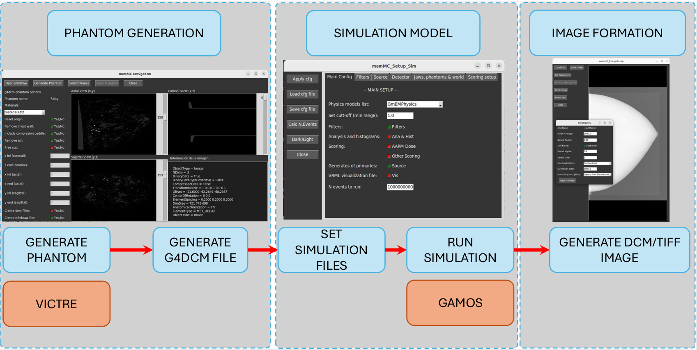

# MIMAC
Mammographic Imaging Monte Carlo (MIMAC) is a code based on [GAMOS](http://fismed.ciemat.es/GAMOS/) (Geant4-based Architecture for Medicine-Oriented Simulations) to simulate mammographic images. GAMOS needs two types of files, first the input files where the physics are defined and the second type of files is the geometry files. 
## Table Of Contents
* [Introduction](#Introduction)
* [Requirements](#Requirements)
* [Documentation](#Documentation)
* [How to run](#How-to-run)
  * [GUI](#GUI)
  * [Run the Simulation](#Run-the-Simulation)
* [Files/Folder Information](#FilesFolder-Information)
* [Notes](#Notes)
* [Citation](#Citation)
* [Links](#Links)

# Introduction
------------------------------------------------------------------------------------------------------------------------------
This code is used to generate a X-ray projection image for breast phantom generated by VICTRE.
The following figure illustrates the workflow of the simulation, from the phantom generation to the image formation.

<p align="center">
</img>
</p>

* First it is needed to generate the voxelized phantom if needed (using VICTRE).
* The file generated by VICTRE has to be converted to a .g4dcm file format with the information about the material and the density of each voxel (using [pyrawTog4.py](pysrc/pyrawTog4.py)). This script can be used for other Voxelized phantoms.
* Edit the [Configuration file](SimConf_files) file with the desired parameters for the simulation and run the [SimRun.py](pysrc/SimRun.py) script to generate all the needed file for the simulation.
* Once all files are generated, run GAMOS as follows:
```
gamos main.in
```
* The last thing to do is analyze the output and generate the image using [energyTodcm.py](pysrc/energyTodcm.py)


# Requirements
------------------------------------------------------------------------------------------------------------------------------

The libraries used are vrey common in Python.

* numpy
* scipy
* matplotlib
* Pillow
* SimpleITK
* tqdm
* vtk
* pydicom
* pandas

To install all the dependencies run:

```
pip install -r requirements.txt
```


# Documentation
------------------------------------------------------------------------------------------------------------------------------

To find further information about the developed code, please refer to the documentation https://predico-project.github.io/MIMAC/ .

# How to run
------------------------------------------------------------------------------------------------------------------------------ç

First clone the repository:

```
git clone https://github.com/PREDICO-Project/MIMAC.git
```


## GUI
------------------------------------------------------------------------------------------------------------------------------

There is a tkinter's based GUI developed to perform all the steps described before easily. Run the GUI with the following line:

```
python3 GUI/mainWindow.py
```

This GUI allows the user to configure the simulation parameters, generate a .g4dcm file when using a voxelized phantom, and create an image from the simulation output.

## Run the Simulation
------------------------------------------------------------------------------------------------------------------------------

Once the user has configured the simulation, it can be executed with:

```
gamos main.in
```

Or you can execute the bash file to run NRUNS at the same time. SEED must be an integer, it will be the initial seed of the simulation, but each run has its own seed.

```
bash sendrun.sh NRUNS SEED
```

# Files/Folder Information
------------------------------------------------------------------------------------------------------------------------------

| File/Folder Name | Description | 
| ------------- | ------------- | 
| [data](data) | Folder with the phantoms in g4dcm and mhd/raw formats. |
| [data/dcm](data/dcm) | Folder with the slices of the phantom in DICOM format. | 
| [data/g4dcm](data/g4dcm) | Folder with the phantoms in g4dcm format. This format is the one compatible with GAMOS. |
| [data/materials](data/materials) | Folder that contains the file with the phantom's material information. | 
| [data/original_mhd](data/original_mhd) | Folder that contains the mhd/raw phantom files generated by VICTRE. |
| [data/new_mhd](data/new_mhd) | Folder that contains the mhd/raw phantom files modified by the pyrawTog4.py script. |
| [geom](geom) | Folder that contains all geometry files for the GAMOS simulation. |
| [geom/worlds](geom/worlds) | Folder that contains geometry files to define the world of the simulation. |
| [geom/elementsInWorld](geom/elementsInWorld) | Folder that contains geometry files. |
| [inputs](inputs) | Folder that contains all input files for the GAMOS simulation. |
| [spectra](spectra) | Folder that contains all spectra files for the GAMOS simulation. |
| [plug-ins](plug-ins) | Folder that contains all files needed for the developed GAMOS's plugins. They must be compiled using ```make```. |
| [vis](vis) | Folder that contains all visualization files for the GAMOS simulation. |
| [main.in](main.in) | Main file to be run with GAMOS. |
| [sendrun.sh](sendrun.sh) | Bash script to run more than one GAMOS simulation at the same time |
| [main_files](main_files) | Auxiliary folder that contains all main*.in files generated by sendrun.sh script. |
| [GUI](GUI) | Folder that contains the code to generate the Graphical User Interface (GUI). |
| [GUI/main.py](GUI/mainWindow.py) | Script to run the GUI. |

See the documentation to find more information about the files and scripts.

# Notes
------------------------------------------------------------------------------------------------------------------------------

In order to speed up the simulation, a Warning from Geant4 that appears when a voxelized phantom composed of many tiny voxels is silenced.

- Go to the G4PhantomParameterisation.cc (GAMOS/external/geant4../source/geometry/navigation/src) file.
- Open the file and comment the lines 369-379.
- G to the directory where Geant4 is installed and remove tmp, lib and bin directories (GAMOS/external/geant4/geant4.10.07.p02.gamos):
```
rm -r tmp lib bin
```
- Compile Geant4, go to the directory where GAMOS has the dependencies of Geant4 (GAMOS/external/geant4../source) and type:
```
source geant4conf.sh
```

```
export G4_NO_VERBOSE=0
```

```
make -jn
```
With n the number of cores used on the compilation.


# Citation
If you use this software, please cite this paper:

```
@article{LOZANO2025104995,
title = {Simulation of digital mammographic images using GAMOS: Proof of concept},
journal = {Physica Medica},
volume = {135},
pages = {104995},
year = {2025},
issn = {1120-1797},
doi = {https://doi.org/10.1016/j.ejmp.2025.104995},
url = {https://www.sciencedirect.com/science/article/pii/S112017972500105X},
author = {F.R. Lozano and V. Sanchez-Lara and C. Huerga and Luis C. Martinez-Gomez and D. Garcia-Pinto},
keywords = {Mammography, Geant4, Monte carlo, Breast imaging, Simulation},
abstract = {Purpose:
To present a simulation pipeline for digital mammography based on the GAMOS framework, enabling realistic image formation and dose estimation using high-fidelity anatomical phantoms and flexible detector modeling.
Methods:
A complete in silico model was implemented using GAMOS and GEANT4, including a Siemens Mammomat Inspiration system geometry, VICTRE voxelized breast phantoms, and two detector models: a direct conversion detector (MCD) and a virtual detector (VD). The simulation incorporated an anti-scatter grid, dose scoring tools, and a GUI for parameter adjustment. Performance metrics were calculated according to IEC 62220-1-2:2007.
Results:
The simulation yielded realistic mammographic images and accurate dose estimates. The MTF, NNPS, and DQE were calculated for both detector models and compared against published values. Maximum DQE differences were approximately 20%, with comparisons performed at spatial frequencies of 0.5, 2.0 and 5.0 mm−1. The MTF50% was 4.25 mm−1 (VD) and 4.35 mm−1 (MCD). Anatomical noise analysis showed β values between 2.67 and 3.16, consistent with clinical data. Dose validation against AAPM TG-195 showed differences below 1.08%.
Conclusion:
The proposed simulation framework is capable of producing realistic mammographic images and accurate dose calculations using an accessible interface. This tool is suitable for virtual clinical trials and system performance evaluation, and allows further extension to advanced imaging techniques such as contrast-enhanced or phase-contrast mammography. Code: https://github.com/PREDICO-Project/MIMAC}
}
```

# Links
- [Geant4 User Guide](https://geant4.web.cern.ch/docs/).
- [GAMOS V6.2.0 User Guide](http://fismed.ciemat.es/GAMOS/GAMOS_doc/GAMOS.6.2.0/GamosUsersGuide_V6.2.0.pdf).
- [GAMOS Tutorials](http://fismed.ciemat.es/GAMOS/gamos_tutorials.php).
- [VICTRE Pipeline](https://github.com/DIDSR/VICTRE_PIPELINE).


