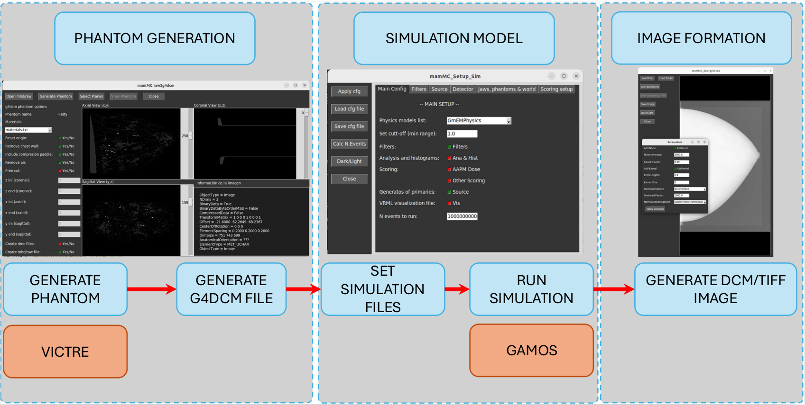

Introduction and Workflow
=========================

This code is used to generate a X-ray projection image for breast phantom generated by VICTRE :doc:`[2] <references>`.
The following figure illustrates the workflow of the simulation, from the phantom generation to the image formation.

The simulation process is divided into four main stages, three of them with their own module with an associated graphical user interface (GUI):

1. **Phantom Generation**: The first step involves generating a voxelized phantom using the VICTRE project. This process creates a 3D representation of the breast tissue, which is essential for accurate simulation.
2. **Simulation Configuration**: The second step involves configuring the simulation parameters. This includes defining the X-ray source, detector, and other relevant settings. The configuration is done through a text file that specifies the simulation parameters.
3. **Simulation Execution**: The third step is to run the simulation and generate output files with the energy deposited in each pixel. This is done using the GAMOS code, which simulates the interaction of X-rays with the voxelized phantom and the detector.
4. **Image Generation**: The final step is to run the final image formation code. This code takes the output files from the simulation and perform several operations to generate the final image. This operations includes transforming the energy output into charge, add electronic noise and applying a Sensistivity Curve to the image. The final image is then saved in a DICOM or MHD/RAW format. 
